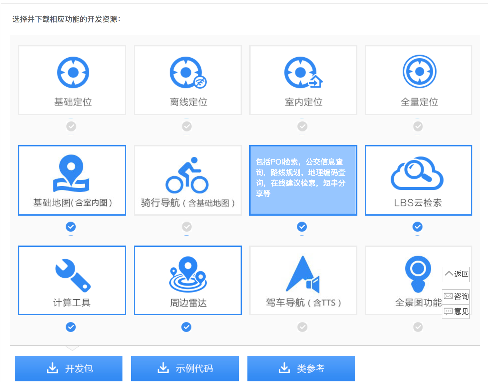

## SDK 下载和环境配置
### SDK 下载
百度地图 API 的下载页为[下载](http://lbsyun.baidu.com/sdk/download?selected=mapsdk_basicmap,mapsdk_searchfunction,mapsdk_lbscloudsearch,mapsdk_calculationtool,mapsdk_radar "百度地图 API 下载页")：

关于各个下载功能，上面都有详细的说明。
### 开发环境配置
1. 获取 Android SH1 值：
	1. 从 Android Studio Gradle task 导出：SigningReport 可以导出。
	2. 从命令行获取
2. 从 `AndroidManifest.xml`  中获取包名
3. 在百度地图 API 网站上获取 AK 值。
4. 填入 AK 值：在 `AndroidMainfest.xml` 文件中，在 `<application>` 标签中，填入

	```xml
	<meta-data 
		android:name="com.baidu.lbsapi.API_KEY"
		android:value="开发者 key"/>
	```

5. 将 SDK 放入相应路径：`.so` 文件放入 `app/src/main/jniLibs` 路径下，`jar` 包放入 `app/libs` 中。[^1]
6. 添加权限

	```xml
		<!--这个权限用于进行网络定位-->
		<uses-permission android:name="android.permission.ACCESS_COARSE_LOCATION"/>
		<!--这个权限用于访问GPS定位-->
		<uses-permission android:name="android.permission.ACCESS_FINE_LOCATION"/>
		<!--用于访问wifi网络信息，wifi信息会用于进行网络定位-->
		<uses-permission android:name="android.permission.ACCESS_WIFI_STATE"/>
		<!--获取运营商信息，用于支持提供运营商信息相关的接口-->
		<uses-permission android:name="android.permission.ACCESS_NETWORK_STATE"/>
		<!--这个权限用于获取wifi的获取权限，wifi信息会用来进行网络定位-->
		<uses-permission android:name="android.permission.CHANGE_WIFI_STATE"/>
		<!--用于读取手机当前的状态-->
		<uses-permission android:name="android.permission.READ_PHONE_STATE"/>
		<!--写入扩展存储，向扩展卡写入数据，用于写入离线定位数据-->
		<uses-permission android:name="android.permission.WRITE_EXTERNAL_STORAGE"/>
		<!--访问网络，网络定位需要上网-->
		<uses-permission android:name="android.permission.INTERNET"/>
		<!--SD卡读取权限，用户写入离线定位数据-->
		<uses-permission android:name="android.permission.MOUNT_UNMOUNT_FILESYSTEMS"/>
	```
7. 使用 SDK 时，首先进行 SDK 初始化，传入 app 的 Context：`SDKInitializer.initializer(getApplicationContext());`。注意，该方法要在 `setContentView` 方法之前实现。

[^1]:	注意：官网上说导入包之后还需要手动添加到编译依赖中，在我现在的 Android Studio 中，默认 Gradle 的 dependencies 中，包含了这样一句话，`compile fileTree(include: ['*.jar'], dir: 'libs')`，即只要我们将 `jar` 包放入 libs 中，就已经导入到项目依赖中了，不需要再额外添加代码。
## 百度地图基本功能
### 显示百度地图
一个最简单的 BaiduMap 应用 HelloMap

首先，按照之前的工程配置方法，完成相关配置。
#### 地图控件 MapView
1. 添加控件

	```xml
	<com.baidu.mapapi.map.MapView
			android:id="@+id/mMapView"
			android:layout_width="match_parent"
			android:layout_height="match_parent"
			android:clickable="true"/>
	```

2. 应用初始化

	```java
	MapView  mMapView;
	    @Override
	    protected void onCreate(Bundle savedInstanceState) {
	        super.onCreate(savedInstanceState);
	        SDKInitializer.initialize(getApplicationContext());
	        setContentView(R.layout.activity_main);
	        mMapView = (MapView) findViewById(R.id.mMapView);
	    }
	```

3. 对 MapView 的生命周期管理

	```java
	@Override
	    protected void onDestroy() {
	        super.onDestroy();
	        //在activity执行onDestroy时执行mMapView.onDestroy()，实现地图生命周期管理
	        mMapView.onDestroy();
	    }
	    @Override
	    protected void onResume() {
	        super.onResume();
	        //在activity执行onResume时执行mMapView. onResume ()，实现地图生命周期管理
	        mMapView.onResume();
	    }
	    @Override
	    protected void onPause() {
	        super.onPause();
	        //在activity执行onPause时执行mMapView. onPause ()，实现地图生命周期管理
	        mMapView.onPause();
	    }
	```

#### 显示结果


如果显示空白地图，很有可能是因为百度 ak 没有注册设定好。需要检查 sh1 是否设置正确，包名是否填写正确，以及权限设定。


